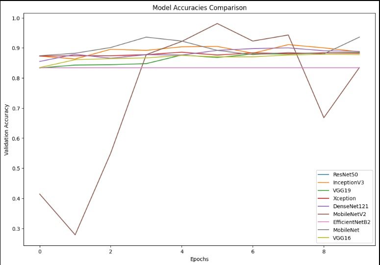
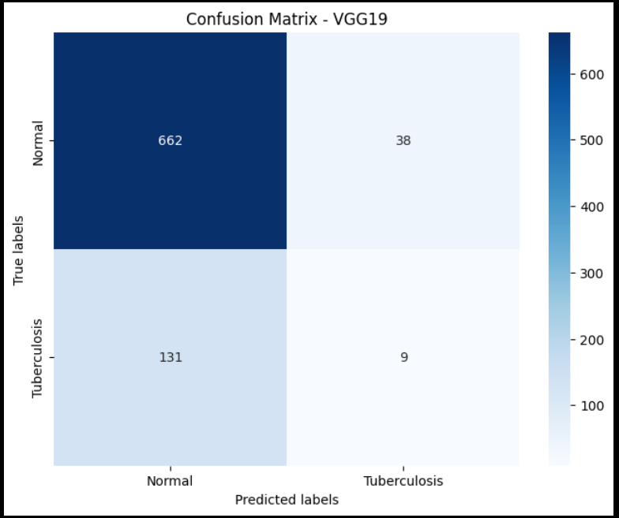
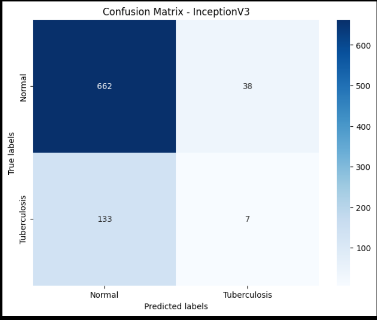
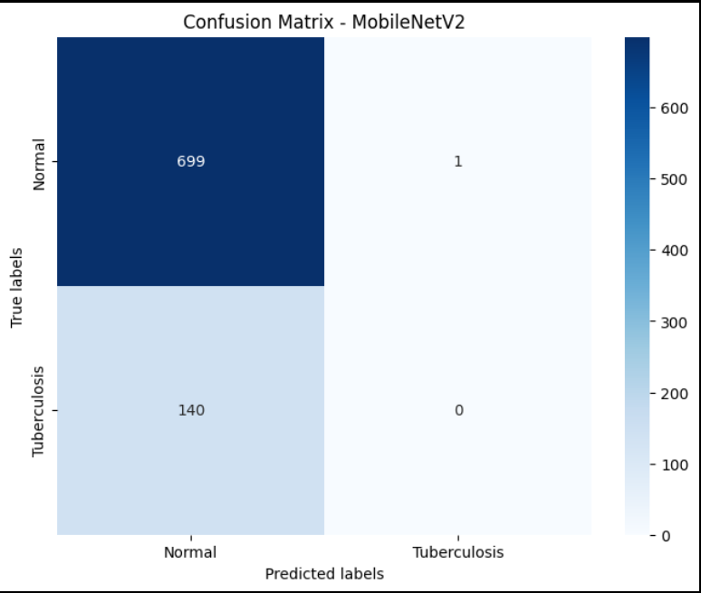
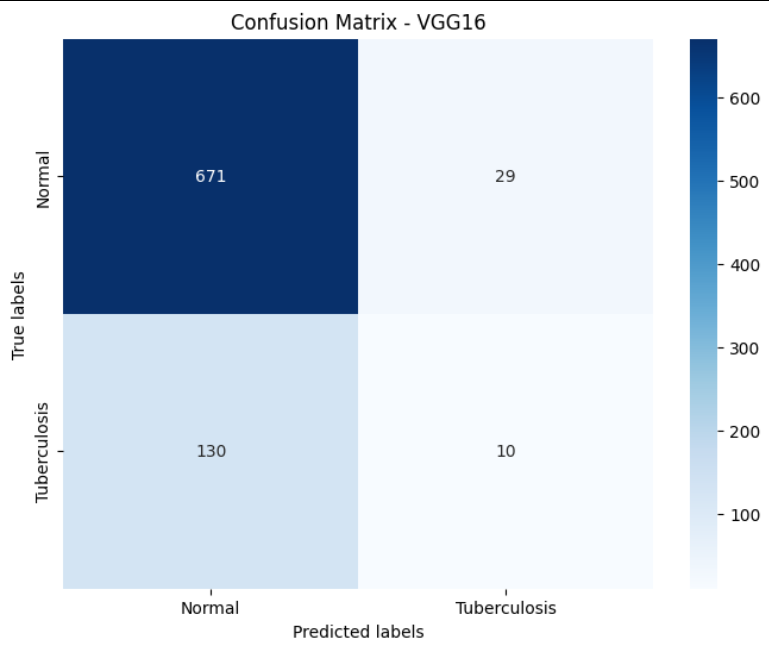

<!DOCTYPE html>
<html lang="en">
<head>
    <meta charset="UTF-8">
    <meta name="viewport" content="width=device-width, initial-scale=1.0">
</head>
<body>
    <h1>Tuberculosis Detection Using Deep Learning</h1>
    
This project focuses on developing and evaluating a deep learning model to detect tuberculosis (TB) from chest X-ray images. The model leverages pre-trained convolutional neural networks (CNNs) to classify images and assist in TB diagnosis.

  <h2>Project Structure</h2>
    <ul>
        <li><strong>Data Downloading and Preparation</strong>:
            
The dataset is automatically downloaded from a specified source, uncompressed, and prepared for training and validation.

        </li>
        <li><strong>Model Creation</strong>:
            
A function <code>create_model</code> is provided to build and compile the deep learning model. This function uses a pre-trained base model, applies global average pooling, and adds a dense layer with softmax activation for classification into TB-positive or TB-negative categories.

        </li>
        <li><strong>Model Evaluation</strong>:
            
A function <code>evaluate_model</code> is used to assess the model's performance. It makes predictions on the validation dataset, computes a confusion matrix, and prints the accuracy score along with a detailed classification report.

        </li>
    </ul>

  <h2>Files</h2>
    <ul>
        <li><code>DS_Project_9Models (1) (1).ipynb</code>: Jupyter notebook containing the entire workflow from data preparation, model creation, training, and evaluation.</li>
    </ul>

  <h2>Requirements</h2>
    <ul>
        <li>Python 3.x</li>
        <li>TensorFlow</li>
        <li>Keras</li>
        <li>NumPy</li>
        <li>Scikit-learn</li>
        <li>Matplotlib</li>
    </ul>

  <h2>How to Run</h2>
    <ol>
        <li>Clone the repository:
            <pre><code>git clone https://github.com/yourusername/tuberculosis-detection.git
cd tuberculosis-detection</code></pre>
        </li>
        <li>Install the required packages:
            <pre><code>pip install -r requirements.txt</code></pre>
        </li>
        <li>Open the Jupyter notebook and run the cells:
            <pre><code>jupyter notebook DS_Project_9Models\ (1)\ (1).ipynb</code></pre>
        </li>
    </ol>

  <h2>Results</h2>
    
The notebook will guide you through the entire process of training the TB detection model and evaluating its performance on the validation dataset. The final output includes accuracy, confusion matrix, and a classification report.

  

  <h3>Model Accuracy Comparison Graph</h3>
 </img>
  

  <h3>Confusion Matrix of each Model</h3>

 

 </img>
 </img>

 </img>
 </img>

 </img>
 </img>

 </img>
 </img>

 </img>

  <h2>Contributing</h2>
    
Contributions are welcome! Please fork the repository and submit pull requests.

<h2>License</h2>
    
This project is licensed under the MIT License - see the <a href="LICENSE">LICENSE</a> file for details.

</body>
</html>
